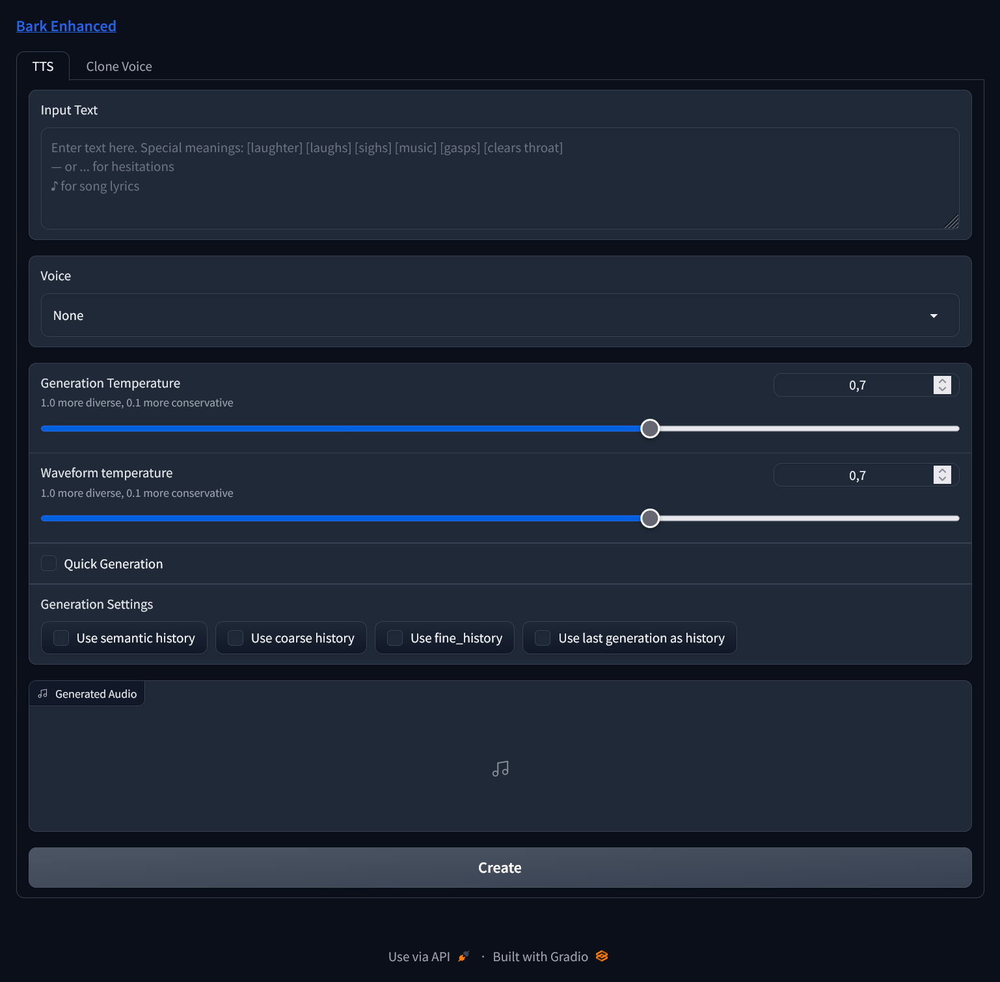
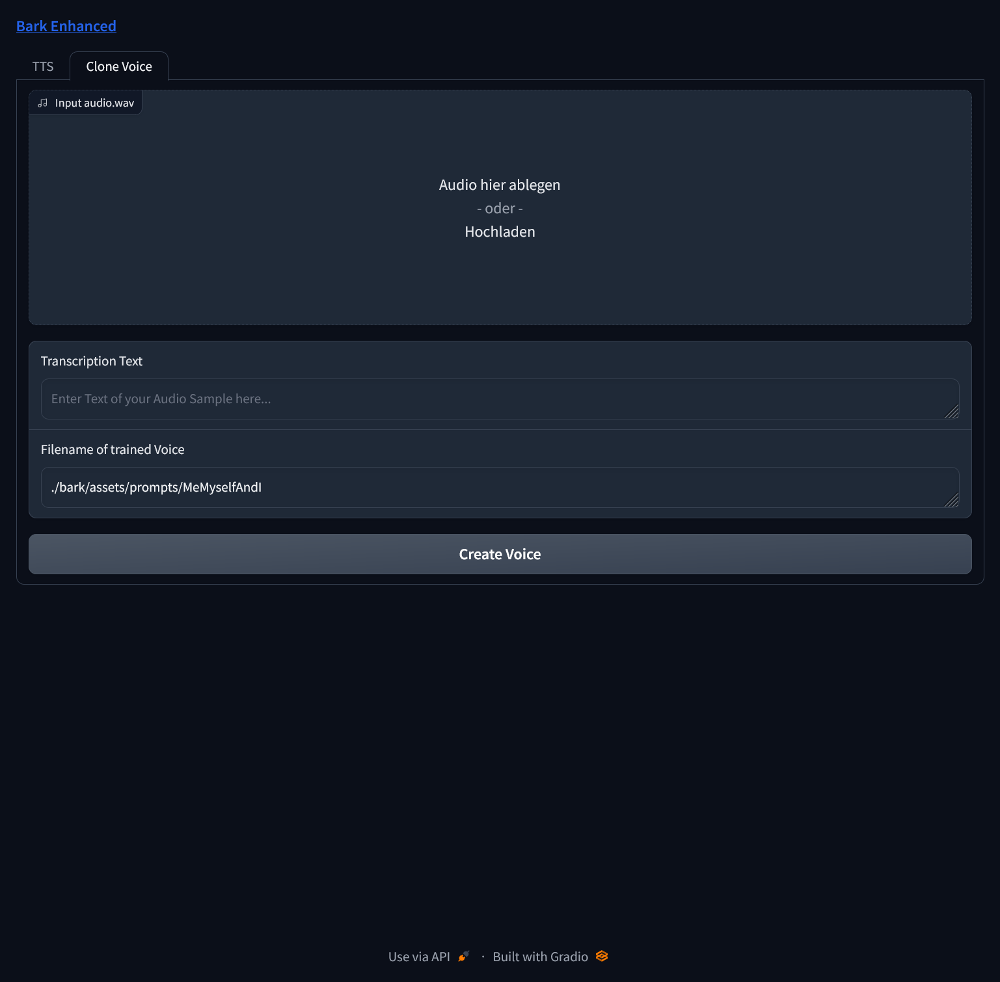

# Bark GUI

[Changelog](#changelog) • [Example](#example-input) • [Installation](#installation) • [Usage](#usage) • [FAQ](#faq)

A Gradio Web UI for an extended - easy to use - Bark Version, focused on Windows running locally.
Based on [Bark](https://github.com/suno-ai/bark)

It now has several extra features, which might make this usable for simple people
like me, who just want to experiment with Bark.

### Additional Features

- Web GUI
- Creation of very large text passages in chunks, combining the parts into a final result
- Creation of new Voices possible (so far very bad results, hopefully improving in the future)
- Easy Selection of Small/Big Models, additional commandline arguments
- Works with 8Gb GPU or force it to use your CPU instead
- Can input SSML to allow fixed voice dialogues (preliminary so far) 

### Example Input:

> Hello, I am called BARK and am a new text to audio model made by SUNO! Let me read an excerpt from War of the Worlds to you. [clears throat]
We know NOW that in the early years of the twentieth century, this world was being watched closely by intelligences greater than man�s and yet as mortal as his own. We know NOW that as human beings busied themselves about their various concerns they were scrutinized and studied, perhaps almost as NARROWLY as a man with a Microscope might scrutinize the transient creatures that swarm and multiply in a drop of water. YET across an immense ethereal gulf, minds that to our minds as ours are to the beasts in the jungle, intellects vast, cool and unsympathetic, regarded this earth with envious eyes and slowly and surely drew their plans against us. [sighs] In the thirty-ninth year of the twentieth century came the great disillusionment.

[Play resulting audio](https://user-images.githubusercontent.com/131583554/234322414-c90330e4-bbe8-4047-bea6-1f783d49204f.webm)

### Installation

For Windows you can now use the 1-click installer released. This will download and install everything
in a handy miniconda environment.
For other OS or if you'd rather like to do this by yourself then:

- `git clone https://github.com/C0untFloyd/bark-gui`
- `pip install .`
- `pip install gradio`
- `pip install soundfile` 
- (optional but necessary for fast generation) install Torch with CUDA `pip install torch torchvision torchaudio --index-url https://download.pytorch.org/whl/cu117 --force-reinstall` 

### Usage

- Windows Either run the `windows_start.bat` from the Installer or use the `StartBark.bat`
- Linux `python webui.py (and optional commandline arguments)`

#### Commandline Arguments:

- -autolaunch Automatically open Browser with Bark-Tab
- -smallmodels Use small models, for GPUs with less than 10Gb Vram or to speed up process
- -forcecpu Force processing on CPU, if your GPU isn't up to the task
- -enablemps Support for Apple MPS
- -offloadcpu Offload models to CPU

On Windows edit the StartBark.bat to your likings.

#### Text-to-Speech Tab

Input any text to let Bark create a Speech, use the Dropbox to choose any voice from
the prompts folder (also custom ones). Choose 'None' for undefined (usefull for MAN:/WOMAN: prompts).
The `Quick Generation` checkbox creates audio a lot faster but might be more unstable and perhaps not that subtle
as this doesn't use finetuning parameters.
Checking `Use last generation as history` saves voices of each audio chunk to the outputs folder. If you want
to use them for output, just copy them into the assets/prompts folder.
Contrary to the original Bark, you can input any text length. The result will be created in chunks
and merged into 1 audio-file at the end. This can be played from the UI and the WAV-File(s) are saved
into the Outputs folder.
    

</img>

A new experimental feature is SSML input and conversion. If you're writing a dialogue like this:
> I'm refreshing the Bark Github Page like crazy, there might be a new update every second!

> You're just very disturbed

and you've selected Voice 'en_speaker_0' in the dropdown box, clicking on `Convert text to SSML` the text would be converted to

<pre>
<code>
&lt?xml version="1.0"?&gt
&ltspeak version="1.0" xmlns="http://www.w3.org/2001/10/synthesis"
         xmlns:xsi="http://www.w3.org/2001/XMLSchema-instance"
         xsi:schemaLocation="http://www.w3.org/2001/10/synthesis
                   http://www.w3.org/TR/speech-synthesis/synthesis.xsd"
         xml:lang="en-US"&gt
         
&ltvoice name="en_speaker_0"&gtI'm refreshing the Bark Github Page like crazy, there might be a new update every second!&lt/voice&gt
&ltvoice name="en_speaker_0"&gtYou're just very disturbed &lt/voice&gt
&lt/speak&gt</code>
</pre>

As you can see every new line will be split as a potential new line for another voice. 
Afterwards you could change one of the speaker names (name="en_speaker_0) to create dialogues with fixed voices. If the number of words
exceeds the max for Bark generation, new lines will be created reusing the voice from the sentence before that.

Clicking on the `Generate` Button will automatically detect if this is SSML input or just plain text.

#### Clone Voice Tab

It's possible to clone your voice, although results so far aren't good.
Input a WAV Audio File with your sampled voice at the top. Below that, input your spoken
words. The path and filename text can be adjusted as you like, the default is the path to
the folder Bark is using for its voices. By clicking "Create" the process is started.

</img>

### FAQ
**Q:** Why do I get the warning "No GPU being used. Careful, inference might be very slow!", although I do have a NVIDIA GPU?

You probably have outdated Torch/CUDA Drivers. Try re-installing them:
`pip install torch torchvision torchaudio --index-url https://download.pytorch.org/whl/cu117 --force-reinstall`

**Q:** I'm using Apple Silicone what can I do to speed up processing?

Use commandline argument `-enablemps` to make Bark use it.

**Q:** How much VRAM do I need to have this run on GPU?

Running this on GPU is currently only possible on NVIDIA Cards with at least 2 Gb VRAM. Below 8 Gb you
would probably need to use the smaller models and if you are still having memory problems, you would need
to use the -offloadcpu command argument, which tries to offload as much memory to your standard memory.

**Q:** Why are there voice changes in the resulting audio files?

Because (from my limited understanding) this is a similar stochastic model as other GPT-Style Models, where each output is based on a previous one.
This has a pretty good entertainment value but is of course suboptimal for plain TTS. Over time there surely will be a solution for stable generation.
Also from my experience, using the special tags like [sighs] etc. at the start/stop of a sentence seem to confuse the model. This seems to
be especially true for languages other than english. If you're not satisfied with the result, just try again and hope for the best.

**Q:** Why are cloned voices so bad?

Probably because the code for cloning is a lot of guesswork so far and was implemented by the authors of the fork
I mentioned at the top. The original Bark authors don't condone voice cloning and I think it will take some time for the
community to find 'the secret sauce'. Best results so far seem to use a very short input clip of 2-4 seconds.

**Q:** Why did you hack this together, when will you implement feature xxx?

Although I'm an experienced programmer, this is my first step into python programming and ML and serves me basically as a learning project.
I've been excited by the Bark Release and as a windows-centric user wanted something simple to run locally, without
caring about colabs, notebooks and the likes. Basically a simple GUI to have fun with Bark. Many repos I checked
had something cool, but where missing features and had no user interface. So I took what I could get from them and improved upon it.
I'm doing this basically for myself but I'm glad if you enjoy my experiments too.

### Changelog

**03.05.2023** First Release v0.4.0

- BUGFIX: Joining prompt names in subfolders
- Release with Windows Installer (lifted & modified from [Oobabooga](https://github.com/oobabooga/one-click-installers))
- Installer .bat includes automatic updater
- Trying to detect voice changes, adding short pause breaks inbetween

**02.05.2023**

- Merged all changes from base Suno branch
- Preloading/downloading all necessary models before server startup
- Supporting subfolders in assets/prompts and new prompts in dropdown
- Added preliminary support/conversion for [SSML](https://www.xml.com/pub/a/2004/10/20/ssml.html) input to allow fixed speakers dialogues
- Added Button to delete all files in output folder
- Misc smaller changes/bugfixes
- Updated Readme.md

**24.04.2023**

Initial Fork & Commit

